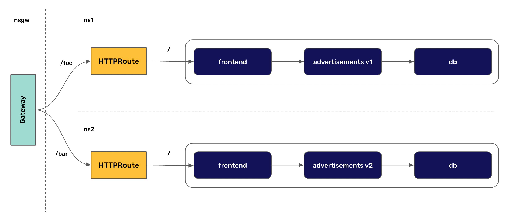

This repository collects a series of Kubernetes Gateway API usage examples, using kind as cluster and Contour as controller.

These are just examples to try out the Gateway API and are not meant to be used in a production environment.

# Environment setting
## Create cluster
The `kind-cluster/cluster.yaml` files creates a kind cluster mapping the `30000` port of your local machine to the `30000` port of the node. This port will be used later on as the `envoy` NodePort. Once the cluster is created. Create the namespaces needed for the examples.

```
kind create cluster --config kind-cluster/cluster.yaml
kubectl apply -f kind-cluster/namespaces.yaml
```

## Deploy the Gateway API CRDs
We deploy version 0.6.0 from the experimental channel:

```
kubectl apply -f gateway-api
```

## Deploy Contour
Deploy Contour (the nightly builds) to use it as Gateway API controller:

```
kubectl apply -f contour/contour.yaml
```

Once Contour is deployed, create the default GatewayClass for the examples:

```
kubectl apply -f contour/gatewayclass.yaml
```

## Deploy ecommerce application
Deploy version 1.0 of the ecommerce application on namespace `ns1` and version 2.0 on namespace `ns2`:

```
kubectl apply -f ecommerce/version1/ -n ns1
kubectl apply -f ecommerce/version2/ -n ns2
```

## (Optional) Deploy the Datadog Agent

The ecommerce application is already instrumented with OpenTelemetry. If you are a Datadog user you can send the Otel traces to Datadog by deploying the Datadog Agent:

```
export DD_API_KEY=<YOUR_DATADOG_API_KEY>
helm install datadog --set datadog.apiKey=$DD_API_KEY datadog/datadog -f datadog/values.yaml
```

As it is OpenTelemetry, feel free to set up a different backend for the OpenTelemetry traces.

## Edit /etc/hosts
The examples below use `store.example.com` as the hostname for the routes. Edit your local `/etc/hosts` file to point to localhost on that one:

```
127.0.0.1       store.example.com
```

# Examples
For every example, once the resources are created, access the application on `http://store.example.com:30000`

## Basic ([`basic` folder](https://github.com/arapulido/gateway-api-examples/tree/main/basic))
The most basic example deploys a Gateway in the namespace `nsgw` and a HTTPRoute in `ns1`.


Once the resources have been created, access the version 1 of the application on `http://store.example.com:30000`. 

## URLRewrite ([`prefix-urlrewrite` folder](https://github.com/arapulido/gateway-api-examples/tree/main/prefix-urlrewrite))
This example showcases how to split traffic based on URL prefixes, but rewriting the path for the backend to get a root (`/`) prefix.



Once the resources have been created, access the version 1 of the application on `http://store.example.com:30000/foo` and the version 2 of the application on `http://store.example.com:30000/bar`.

## Traffic Weight ([`traffic-weight` folder](https://github.com/arapulido/gateway-api-examples/tree/main/traffic-weight))
This example showcases how to split traffic by weight and how to cross namespaces boundaries safely using ReferenceGrant resources.


Once the resources have been created, access the application on `http://store.example.com:30000/`. 80% of the times you get version 1 and 20% of the times you get version 2.
